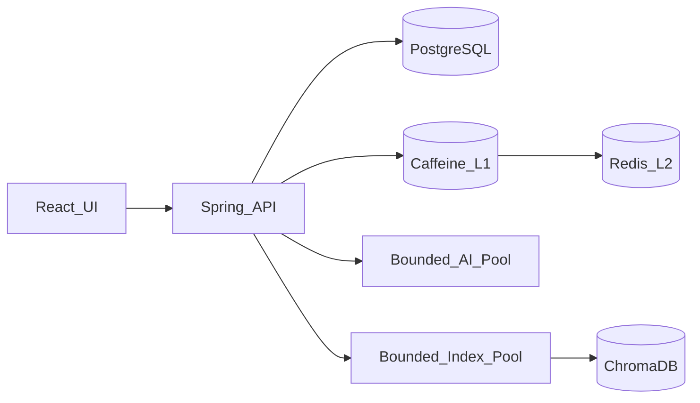

# Smart Task Management System

[中文文档](README.md)

Companion documents:
- [技术文档（中文）](docs/TECHNICAL.zh-CN.md) / [Technical Guide (English)](docs/TECHNICAL.en.md)
- [架构文档（中文）](docs/ARCHITECTURE.zh-CN.md) / [Architecture Guide (English)](docs/ARCHITECTURE.en.md)

## Track
Full Stack + AI/LLM

A quality-first task management sample: Spring Boot provides reliable task and dependency APIs, React provides a responsive workspace, and AI supports natural-language task creation and decomposition.

## Technology Stack
- Languages: Java 21, TypeScript
- Frameworks: Spring Boot, Spring Data JPA, React, TanStack Query, Vite
- Data stores: PostgreSQL (source of truth), Redis (L2 cache), ChromaDB (vector index), H2 (tests)
- Infrastructure: Caffeine, Resilience4j, Micrometer/Prometheus, Flyway, Docker Compose, GitHub Actions

## Implemented Features
- [x] Validated task CRUD with consistent error responses
- [x] Filtering, keyword search, sorting, offset and cursor pagination
- [x] Dependency graph, cycle detection, completion guards and tree queries
- [x] Natural-language parsing, tag/priority suggestions and task decomposition
- [x] Responsive UI, optimistic status updates, filters and dark mode
- [x] Caffeine L1 + Redis L2 cache with fail-open behavior
- [x] ChromaDB semantic search, asynchronous indexing, reconciliation and keyword fallback
- [x] Composite indexes, optimistic locking and HikariCP tuning
- [x] Database-backed `Idempotency-Key` support
- [x] Liveness/readiness probes with degraded Redis semantics
- [x] Bounded executors, read-only retries, rate limiting, circuit breakers and graceful shutdown

## Running the Application
### Zero-configuration development
Requirements: JDK 21, Maven 3.9+, Node.js 24+.

```bash
# Terminal 1: in-memory H2 is used by default
cd backend
mvn spring-boot:run

# Terminal 2
cd frontend
npm install
npm run dev
```

Open http://localhost:5173. The API runs at http://localhost:8080.

### Complete Docker stack
Run these commands in Windows PowerShell from the project root:

```powershell
Copy-Item .env.example .env
notepad .env
docker compose up --build -d
docker compose ps
```

This starts PostgreSQL, Redis, ChromaDB, the backend and the frontend. The first start downloads container images and Chroma's embedding model, so it is slower than subsequent starts.

Useful commands:

```powershell
docker compose logs -f backend
docker compose logs -f chroma
docker compose down       # stop and retain volumes
docker compose down -v    # stop and delete all local data
```

## DeepSeek Configuration
The backend uses the OpenAI-compatible Chat Completions protocol. Put the following values in `.env`:

```env
OPENAI_API_KEY=your_DeepSeek_API_key
OPENAI_BASE_URL=https://api.deepseek.com/v1
OPENAI_MODEL=deepseek-flash
```

The `OPENAI_*` names describe the compatible protocol and do not restrict the provider. Never put a real key in `.env.example` or commit `.env`.
If the DeepSeek console shows a different model for your account, use that exact name as `OPENAI_MODEL`.

`.env.example` is the public template with an empty key; `.env` is your private machine-only configuration and is excluded by `.gitignore`. Never place the key in a frontend `VITE_*` variable because it would be bundled into the browser. See the [technical guide](docs/TECHNICAL.en.md#template-vs-private-configuration) for verification commands.

Verify the running stack:

```powershell
Invoke-RestMethod http://localhost:8080/livez
Invoke-RestMethod http://localhost:8080/readyz

$body = '{"text":"Remind me to submit the report tomorrow at 3 PM"}'
Invoke-RestMethod -Method Post `
  -Uri http://localhost:8080/api/ai/parse-task `
  -ContentType application/json `
  -Body $body
```

`source: "llm"` means DeepSeek answered successfully. `source: "rules"` means the API key was absent or the external service timed out, was rate-limited, or failed, so the deterministic local fallback was used.

## API
Statuses: `pending | in_progress | completed`. Priorities: `low | medium | high`.

| Method | Endpoint | Purpose |
|---|---|---|
| POST | `/api/tasks` | Create a task; supports `Idempotency-Key` |
| GET | `/api/tasks/{id}` | Get one task |
| GET | `/api/tasks` | Filter, sort and paginate |
| GET | `/api/tasks/cursor` | Keyset pagination by timestamp and ID |
| GET | `/api/tasks/semantic-search` | Chroma semantic search with SQL fallback |
| PUT | `/api/tasks/{id}` | Replace task details |
| DELETE | `/api/tasks/{id}` | Delete a task |
| POST/DELETE | `/api/tasks/{id}/dependencies/{dependencyId}` | Add/remove a dependency |
| GET | `/api/tasks/{id}/dependency-tree` | Read the dependency tree |
| POST | `/api/ai/parse-task` | Parse natural language |
| POST | `/api/ai/decompose` | Decompose a complex task |
| GET | `/livez` | Process liveness only |
| GET | `/readyz` | DB readiness; Redis can be DEGRADED |
| GET | `/actuator/prometheus` | Runtime metrics |

The list endpoint accepts `status`, `priority`, `tag`, `query`, `page`, `size`, `sort` and `direction`. For deep pagination, use `/api/tasks/cursor?size=50&after={nextCursor}`.

```bash
curl -X POST http://localhost:8080/api/tasks \
  -H "Content-Type: application/json" \
  -H "Idempotency-Key: create-task-20260916-001" \
  -d '{"title":"Ship API","priority":"high","tags":["backend"]}'
```

The same key and request create one task. Reusing a key with a different request returns `409`. Database uniqueness resolves concurrent races without duplicate tasks.

## Architecture and Decisions


- Controllers handle HTTP concerns, services own business rules, repositories own persistence, and DTOs isolate the API from entities.
- Both PostgreSQL and MySQL 8 can handle 100k tasks. PostgreSQL was selected for dependency constraints, `Instant` time semantics, keyset-query diagnostics, and future JSONB/full-text/pgvector options. See the [architecture comparison](docs/ARCHITECTURE.en.md#why-postgresql-instead-of-mysql).
- Caffeine atomically coalesces concurrent misses for the same key. Redis TTL is five minutes plus 0–60 seconds of jitter. Writes evict after transaction commit.
- Redis is optional: failures return `DEGRADED` health and reads fall back to PostgreSQL.
- Only idempotent reads retry transient data-access failures (two attempts, 50 ms delay). Writes are never retried blindly.
- AI and vector indexing use separate bounded executors. Rate limits and circuit breakers isolate slow dependencies.
- HTTP requests, transactions and executors get up to 30 seconds to finish during graceful shutdown.
- ChromaDB is a rebuildable derived index, never the source of truth.

## 100k+ Task Considerations
- HikariCP uses at most 16 connections, a 3-second acquisition timeout and 10-second leak detection.
- PostgreSQL statements are limited to five seconds and idle transactions to ten seconds in Docker.
- Composite indexes cover common filters and `(created_at, id)` keyset pagination.
- Caffeine is capped at 10,000 entries; Redis is capped at 256 MB with LRU eviction.
- Recent tasks are periodically reconciled into Chroma, and semantic search falls back to SQL if Chroma fails.
- Prometheus exposes JVM, HTTP, HikariCP, Caffeine and Resilience4j metrics.
- Docker Compose is a single-host demonstration, not database HA. Production should use managed PostgreSQL/Redis failover and a small number of stateless backend replicas.

### ADR: Why RabbitMQ Is Not Included
The current background work is a rebuildable vector index at low write volume. After-commit events, a bounded executor, circuit breaking and periodic reconciliation are simpler and sufficient.

RabbitMQ alone cannot atomically coordinate a database commit with message publication. If durable cross-instance processing, non-lossy background jobs or sustained high write throughput become requirements, use a **Transactional Outbox + RabbitMQ + idempotent consumers**.

### ADR: Why Read/Write Splitting Is Not Included
At this scale and deployment size, replication lag and routing complexity cost more than they save. Read-only transactions are already marked, so `AbstractRoutingDataSource` can be introduced when measured primary read load justifies a replica.

## Tests
```bash
cd backend && mvn test
cd frontend && npm run lint && npm run build

# Run after the backend is started
REQUESTS=1000 CONCURRENCY=25 node scripts/load-test.mjs
```

Ten backend tests cover CRUD, idempotency, health probes, Redis degradation, pagination, cache invalidation and miss coalescing, optimistic locking, dependencies, semantic fallback and asynchronous AI.

## Known Limitations
- No authentication or multi-tenancy.
- The deterministic AI fallback recognizes only common English and Chinese date expressions.
- Very large dependency graphs should use a bounded recursive CTE.
- With multiple instances, L1 cache can be stale within its short TTL. Disable L1 for strict consistency or add Redis Pub/Sub invalidation.
- Docker credentials are for local demonstration only.

## Future Work
Authentication, reminders, end-to-end tests, Grafana dashboards, and Outbox + RabbitMQ when the ADR thresholds are reached.

## AI Assistance Disclosure
An AI coding assistant was used during development. Architecture boundaries, consistency rules, degradation behavior and tests are documented for human review.

## Time Spent
Approximately four hours.
