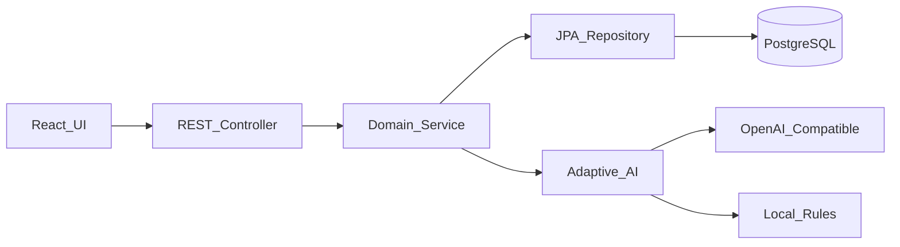

# 智能任务管理系统

## 岗位方向
全栈 + AI/LLM

一个质量优先的任务管理示例：Spring Boot 提供可靠的任务与依赖 API，React 提供响应式工作台，AI 支持自然语言建任务和任务拆解。

## 技术栈
- 语言：Java 21、TypeScript
- 框架：Spring Boot、Spring Data JPA、React、TanStack Query、Vite
- 数据库：PostgreSQL（Docker/生产），H2（零配置本地开发与测试）
- 其他：Flyway、Maven、Docker Compose、GitHub Actions

## 已实现功能
- [x] 任务 CRUD、输入验证、统一错误响应
- [x] 按状态/优先级/标签/关键词筛选，排序与分页
- [x] 任务依赖、环检测、完成前置检查、依赖树查询
- [x] 自然语言任务解析与标签/优先级建议
- [x] AI 任务拆解；无 API Key 时自动使用本地规则
- [x] 响应式界面、快捷状态更新、搜索筛选、乐观更新、深色模式
- [x] Flyway schema、索引、集成测试、健康检查、Docker、CI

## 安装说明
### 方式一：零配置本地开发
前置要求：JDK 21、Maven 3.9+、Node.js 24+。

```bash
# 终端 1（默认使用内存 H2）
cd backend
mvn spring-boot:run

# 终端 2
cd frontend
npm install
npm run dev
```

访问 http://localhost:5173。API 位于 http://localhost:8080，健康检查为 `/actuator/health`。

### 方式二：Docker + PostgreSQL
```bash
cp .env.example .env       # 可选：填写 OPENAI_API_KEY
docker compose up --build
```

仍访问 http://localhost:5173。停止并保留数据：`docker compose down`。

### AI 配置
支持 OpenAI Chat Completions 兼容服务：

```env
OPENAI_API_KEY=...
OPENAI_BASE_URL=https://api.openai.com/v1
OPENAI_MODEL=gpt-4o-mini
```

Key 未配置、超时或服务异常时会降级到确定性规则，并在响应 `source` 中返回 `rules`；密钥不会进入仓库。

## API 文档
任务状态：`pending | in_progress | completed`；优先级：`low | medium | high`。

| 方法 | 端点 | 说明 |
|---|---|---|
| POST | `/api/tasks` | 创建任务 |
| GET | `/api/tasks/{id}` | 查询单个任务 |
| GET | `/api/tasks` | 筛选、排序和分页 |
| PUT | `/api/tasks/{id}` | 完整更新任务 |
| DELETE | `/api/tasks/{id}` | 删除任务 |
| POST/DELETE | `/api/tasks/{id}/dependencies/{dependencyId}` | 增删依赖 |
| GET | `/api/tasks/{id}/dependency-tree` | 查询依赖树 |
| POST | `/api/ai/parse-task` | 解析自然语言 |
| POST | `/api/ai/decompose` | 拆解复杂任务 |

列表参数：`status`、`priority`、`tag`、`query`、`page`、`size`（最大 100）、`sort`、`direction`。

```bash
curl -X POST http://localhost:8080/api/tasks \
  -H "Content-Type: application/json" \
  -d '{"title":"发布 API","priority":"high","tags":["backend"]}'

curl "http://localhost:8080/api/tasks?status=pending&sort=createdAt&direction=desc"

curl -X POST http://localhost:8080/api/ai/parse-task \
  -H "Content-Type: application/json" \
  -d '{"text":"提醒我明天下午3点买杂货"}'
```

冲突（环依赖、前置任务未完成）返回 `409`；资源不存在返回 `404`；验证失败返回带字段详情的 `400`。

## 设计决策


- Controller 只处理 HTTP 与参数；Service 集中业务规则；Repository 只负责持久化；DTO 隔离 API 与实体。
- `task_dependencies(task_id, depends_on_id)` 使用复合主键和双外键；服务层 DFS 防止环，数据库约束防止自依赖。
- schema 由 Flyway 管理；状态、优先级、创建时间、标签和反向依赖均有索引。
- AI 只产生建议，不直接写库，避免模型输出造成不可逆副作用。

## 扩展到 10 万+ 任务
- 当前分页、组合索引与 Hibernate 批量抓取可避免明显 N+1；用 `EXPLAIN ANALYZE` 按真实查询调整复合索引。
- 深页改为基于 `(created_at, id)` 的游标分页；搜索迁移到 PostgreSQL FTS 或 Elasticsearch。
- 热门查询可加短 TTL Redis 缓存，并在写操作后按任务/筛选版本失效；当前规模不提前引入一致性成本。
- 多实例部署保持 API 无状态，数据库使用连接池、只读副本与指标告警。

## 挑战与解决方案
- 依赖图完整性：写入时检测自依赖和间接环，完成时检查所有直接依赖。
- 外部 AI 不稳定：短超时、结构化 JSON、低 temperature，并提供本地降级。
- 前后端一致性：共享明确的字符串枚举，前端 mutation 后统一刷新服务端状态。

## 测试
```bash
cd backend && mvn test
cd frontend && npm run lint && npm run build
```

后端集成测试覆盖 CRUD、筛选、验证、分页、依赖完成约束、环检测和 AI 降级。

## 已知限制
- 无用户认证/多租户；规则降级只覆盖常见中英文时间表达。
- 依赖树按请求递归读取，超大图应改为递归 CTE 并限制深度。
- PostgreSQL 容器使用演示凭据，生产环境必须通过密钥管理注入。

## 未来改进
认证授权、Redis 缓存、语义搜索、截止日期提醒、端到端测试与可观测性面板。

## AI 使用说明
项目开发使用了 AI 编程助手；架构边界、数据约束、降级策略和测试均在 README 中明确，便于人工审查。

## 花费时间
约 3 小时。
