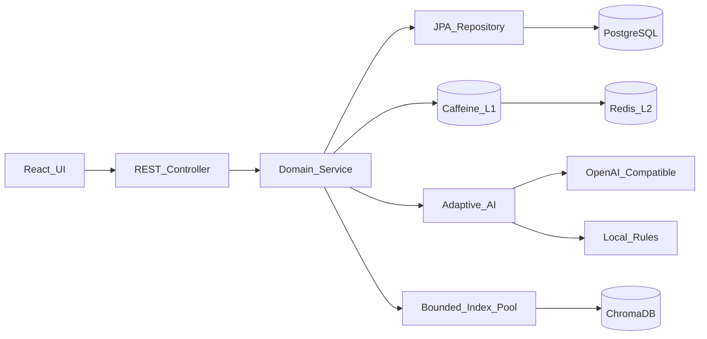

# 智能任务管理系统

## 岗位方向
全栈 + AI/LLM

一个质量优先的任务管理示例：Spring Boot 提供可靠的任务与依赖 API，React 提供响应式工作台，AI 支持自然语言建任务和任务拆解。

## 技术栈
- 语言：Java 21、TypeScript
- 框架：Spring Boot、Spring Data JPA、React、TanStack Query、Vite
- 数据库：PostgreSQL（事实源）、Redis（L2 缓存）、ChromaDB（向量索引）、H2（测试）
- 其他：Caffeine、Resilience4j、Micrometer/Prometheus、Flyway、Docker Compose、GitHub Actions

## 已实现功能
- [x] 任务 CRUD、输入验证、统一错误响应
- [x] 按状态/优先级/标签/关键词筛选，排序与分页
- [x] 任务依赖、环检测、完成前置检查、依赖树查询
- [x] 自然语言任务解析与标签/优先级建议
- [x] AI 任务拆解；无 API Key 时自动使用本地规则
- [x] 响应式界面、快捷状态更新、搜索筛选、乐观更新、深色模式
- [x] Caffeine + Redis 两级缓存、精确失效与 Redis 故障放行
- [x] ChromaDB 语义搜索、异步索引、定时校准与关键词降级
- [x] 游标分页、复合索引、乐观锁、HikariCP 调优
- [x] Idempotency-Key 数据库去重，支持客户端安全重试
- [x] Liveness/Readiness 分级健康检查，Redis 故障显示 DEGRADED
- [x] 有界线程池、读重试、限流、熔断、Prometheus 指标、优雅停机、Docker、CI

## 安装说明
### 方式一：零配置本地开发
前置要求：JDK 21、Maven 3.9+、Node.js 24+。

```bash
# 终端 1（默认使用内存 H2）
cd backend
mvn spring-boot:run

# 终端 2
cd frontend
npm install
npm run dev
```

访问 http://localhost:5173。API 位于 http://localhost:8080，健康检查为 `/actuator/health`。

### 方式二：完整 Docker 栈
```bash
cp .env.example .env       # 可选：填写 OPENAI_API_KEY
docker compose up --build
```

该方式启动 PostgreSQL、Redis、ChromaDB、后端与前端。仍访问 http://localhost:5173；停止并保留数据：`docker compose down`。

### AI 配置
支持 OpenAI Chat Completions 兼容服务：

```env
OPENAI_API_KEY=...
OPENAI_BASE_URL=https://api.openai.com/v1
OPENAI_MODEL=gpt-4o-mini
```

Key 未配置、超时或服务异常时会降级到确定性规则，并在响应 `source` 中返回 `rules`；密钥不会进入仓库。

## API 文档
任务状态：`pending | in_progress | completed`；优先级：`low | medium | high`。

| 方法 | 端点 | 说明 |
|---|---|---|
| POST | `/api/tasks` | 创建任务 |
| GET | `/api/tasks/{id}` | 查询单个任务 |
| GET | `/api/tasks` | 筛选、排序和分页 |
| GET | `/api/tasks/cursor` | 基于时间和 ID 的游标分页 |
| GET | `/api/tasks/semantic-search` | ChromaDB 语义检索，失败自动降级 |
| PUT | `/api/tasks/{id}` | 完整更新任务 |
| DELETE | `/api/tasks/{id}` | 删除任务 |
| POST/DELETE | `/api/tasks/{id}/dependencies/{dependencyId}` | 增删依赖 |
| GET | `/api/tasks/{id}/dependency-tree` | 查询依赖树 |
| POST | `/api/ai/parse-task` | 解析自然语言 |
| POST | `/api/ai/decompose` | 拆解复杂任务 |
| GET | `/actuator/prometheus` | JVM、HTTP、连接池、缓存与熔断指标 |
| GET | `/livez` | 仅检查进程存活，不探测外部依赖 |
| GET | `/readyz` | DB 必须可用；Redis 故障为 DEGRADED 但仍接流量 |

列表参数：`status`、`priority`、`tag`、`query`、`page`、`size`（最大 100）、`sort`、`direction`。
深分页使用 `/api/tasks/cursor?size=50&after={nextCursor}`，避免数据库扫描并丢弃大量 offset 行。

```bash
curl -X POST http://localhost:8080/api/tasks \
  -H "Content-Type: application/json" \
  -H "Idempotency-Key: create-task-20260916-001" \
  -d '{"title":"发布 API","priority":"high","tags":["backend"]}'

curl "http://localhost:8080/api/tasks?status=pending&sort=createdAt&direction=desc"

curl -X POST http://localhost:8080/api/ai/parse-task \
  -H "Content-Type: application/json" \
  -d '{"text":"提醒我明天下午3点买杂货"}'
```

冲突（环依赖、前置任务未完成）返回 `409`；资源不存在返回 `404`；验证失败返回带字段详情的 `400`。
相同 `Idempotency-Key` 与相同请求体只创建一次；同一 Key 配合不同请求返回 `409`。并发竞争由数据库主键约束兜底，失败客户端可用同一 Key 安全重试。

## 设计决策


- Controller 只处理 HTTP 与参数；Service 集中业务规则；Repository 只负责持久化；DTO 隔离 API 与实体。
- `task_dependencies(task_id, depends_on_id)` 使用复合主键和双外键；服务层 DFS 防止环，数据库约束防止自依赖。
- schema 由 Flyway 管理；常用筛选与 `(created_at, id)` 游标有复合索引，`version` 防止并发覆盖。
- 按 ID 查询采用 Cache-Aside：Caffeine 原子加载合并同 Key 并发 miss，Redis TTL 为 5 分钟加 0–60 秒随机抖动；事务提交后精确失效，Redis 异常直接回源。
- AI 和向量索引分别使用有界线程池；AI 队列满返回 429，索引池使用调用方背压。Resilience4j 对 AI 限流并熔断慢外部依赖。
- 只有 `GET` 查询标记了瞬时数据访问异常重试（2 次、50ms 间隔）；写操作绝不自动重试，改由 `Idempotency-Key` 保证客户端显式重试安全。
- `/livez` 不检查外部依赖；`/readyz` 要求 DB 可用。Redis fail-open 时自定义 HealthIndicator 返回 `DEGRADED` 和 HTTP 200。
- HTTP、事务内请求和两个线程池均参与优雅停机，统一最多等待 30 秒。
- AI 只产生建议，不直接写库，避免模型输出造成不可逆副作用。

## 扩展到 10 万+ 任务
- HikariCP 默认最多 16 个连接、获取连接超时 3 秒、泄漏检测 10 秒；PostgreSQL 查询上限 5 秒，空闲事务上限 10 秒。
- 普通列表保留 offset 方便 UI；深页使用 keyset 查询，时间复杂度不随页码线性恶化。
- 两级缓存吸收热点主键读取；Caffeine 有 1 万条容量上限，Redis 有 TTL 和 256 MB LRU 上限，内存使用可控。
- Chroma 是可重建的派生索引：写事务提交后异步更新，并定时校准最近 200 条任务；失败时搜索降级到 SQL `LIKE`。
- `/actuator/prometheus` 暴露 JVM、HTTP、Hikari、Caffeine 和 Resilience4j 指标，容量调整应基于 p95/p99 与命中率，而不是盲目扩线程。
- Docker Compose 是单机演示，不宣称数据库高可用；生产可运行少量无状态后端实例，并使用托管 PostgreSQL/Redis 的备份与故障转移。

### ADR：为什么没有引入 RabbitMQ
当前写入量低，后台工作只有可重建的向量索引。事务提交事件、有界线程池、熔断降级和定时校准已经满足需求，引入 RabbitMQ 会额外增加部署、监控、重试和死信处理成本。

更重要的是，只发送 RabbitMQ 消息不能保证“数据库提交”和“消息发布”原子完成。只有当系统需要跨实例可靠消费、不可丢的后台任务或持续高吞吐时，才应引入 **Transactional Outbox + RabbitMQ + 幂等消费者**。在此之前不加入空转组件，是有意的架构取舍。

## 挑战与解决方案
- 依赖图完整性：写入时检测自依赖和间接环，完成时检查所有直接依赖。
- 外部 AI 不稳定：短超时、结构化 JSON、低 temperature，并提供本地降级。
- 前后端一致性：共享明确的字符串枚举，前端 mutation 后统一刷新服务端状态。

## 测试
```bash
cd backend && mvn test
cd frontend && npm run lint && npm run build

# 应用启动后，对热点主键缓存做轻量压测
REQUESTS=1000 CONCURRENCY=25 node scripts/load-test.mjs
```

后端 10 项测试覆盖 CRUD、幂等创建、健康探针、Redis 降级、筛选、offset/游标分页、缓存失效与并发 miss 合并、乐观锁、依赖约束、语义搜索降级和异步 AI。

## 已知限制
- 无用户认证/多租户；规则降级只覆盖常见中英文时间表达。
- 依赖树按请求递归读取，超大图应改为递归 CTE 并限制深度。
- 多实例启用 Caffeine 时可能在 TTL 内短暂读到旧值；严格一致部署应关闭 L1，或增加 Redis Pub/Sub 失效广播。
- 暂未启用读写分离：10 万任务和少量实例下主从复制复杂度高于收益；代码已区分只读事务，达到主库读负载瓶颈后可接入 `AbstractRoutingDataSource`。
- PostgreSQL 容器使用演示凭据，生产环境必须通过密钥管理注入。

## 未来改进
认证授权、截止日期提醒、端到端测试、Grafana 面板，以及达到 ADR 所述阈值后的 Outbox + RabbitMQ。

## AI 使用说明
项目开发使用了 AI 编程助手；架构边界、数据约束、降级策略和测试均在 README 中明确，便于人工审查。

## 花费时间
约 4 小时。
