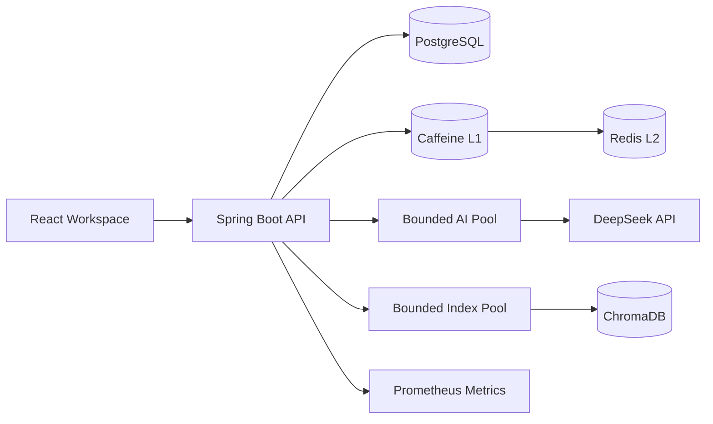
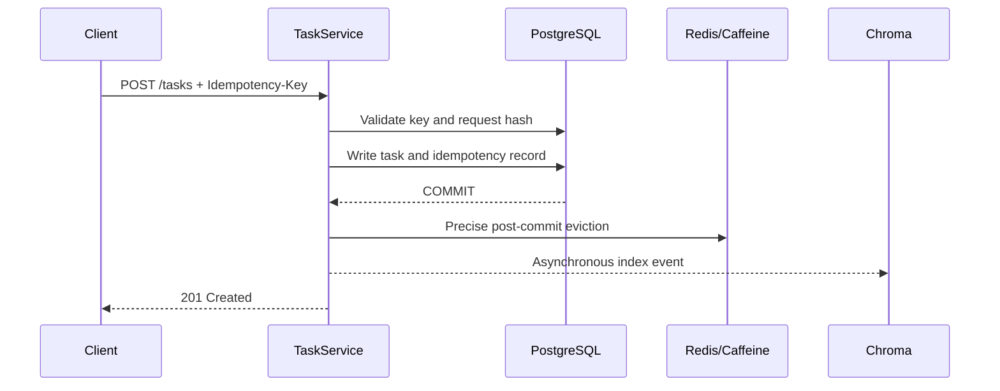

# Architecture Guide

[中文](ARCHITECTURE.zh-CN.md) · [Back to English README](../README.en.md)

## 1. Goals and Boundaries
The system targets 100k+ tasks and a small number of application instances on ordinary hardware. It prioritizes predictable latency, fault isolation and operational simplicity. PostgreSQL is the only source of truth; Redis and ChromaDB are optional, recoverable derived components. Authentication, multi-tenancy and database-level high availability are outside the current scope.

## 2. Component View

The Spring Boot backend is stateless apart from its short-lived Caffeine cache. Production can run a few backend replicas while managed PostgreSQL and Redis provide backups and failover.

## 3. Layer Responsibilities
- Controller: protocol conversion, validation and HTTP status.
- Service: transaction boundaries, dependencies, idempotency, cache and index coordination.
- Repository: JPA queries and persistence.
- Domain/DTO: internal state and external API contracts.
- Adapter: Redis, DeepSeek, Chroma and other external systems.

## 4. Core Write Flow

Derived stores are untouched before commit. A small crash window remains between the database commit and asynchronous indexing; scheduled reconciliation repairs recent tasks. Chroma therefore provides eventually consistent search only.

## 5. Read and Cache Flow
ID reads check Caffeine, Redis and PostgreSQL in order. Caffeine's atomic loader coalesces concurrent misses for the same key. Redis failures fall through immediately without long retries. Successful writes evict both cache levels after commit.

In a multi-instance deployment, local L1 data can be briefly stale within its short TTL. Disable L1 for strict consistency, or add Redis Pub/Sub invalidation when both hit rate and tighter consistency matter.

## 6. Concurrency and Backpressure
- Optimistic locking rejects writes based on an old `version`.
- A full AI queue rejects requests and maps overload to HTTP 429.
- The indexing pool uses CallerRunsPolicy, slowing producers instead of silently dropping events.
- HikariCP has fewer connections than business threads to avoid a connection storm during application overload.
- Only idempotent reads retry transient database failures. Clients retry writes explicitly with an idempotency key.

## 7. Availability Model
- PostgreSQL: hard dependency; readiness is DOWN when unavailable.
- Redis: soft dependency; status is DEGRADED and reads fall back to PostgreSQL.
- Chroma: soft dependency; semantic search falls back to keyword search.
- DeepSeek: soft dependency; AI suggestions fall back to local rules.
- `/livez` does not probe dependencies, preventing dependency flaps from restarting the process.

## 8. Data Design for 100k+ Tasks
- Composite indexes cover common status, priority, timestamp and ID filters.
- `(created_at, id)` provides stable keyset pagination whose cost does not grow linearly with page depth.
- Offset pagination remains only for shallow UI pages.
- Caffeine has a hard 10,000-entry limit; Redis has a 256 MB limit and LRU eviction.
- Connection pools, external timeouts, executors and queues all have explicit bounds.

## 9. Deployment View
Docker Compose is a single-host development and demonstration topology, not real high availability. A production deployment should:
1. Run 2–3 stateless backend instances behind a load balancer.
2. Use PostgreSQL with backups, monitoring and failover.
3. Keep Redis optional; disable caching when strict consistency is required.
4. Treat Chroma data as rebuildable from PostgreSQL.
5. Scale from measured p95/p99 latency, pool waits and cache hit rates.

## 10. Architecture Decision Records
### Why PostgreSQL Instead of MySQL
PostgreSQL was not chosen because it is universally faster; either database can easily handle 100k tasks. It was selected because it better fits this model and its likely evolution:

1. **Relational integrity first**: task dependencies form a graph with a composite primary key, two foreign keys and a check constraint. PostgreSQL has mature complex constraints, transaction semantics and recursive CTE support for moving very large dependency traversals into the database.
2. **Clear time semantics**: entities use Java `Instant` and migrations use `TIMESTAMP WITH TIME ZONE`, avoiding ambiguity when server time zones change.
3. **Stable deep pagination and diagnostics**: a `(created_at, id)` index supports keyset pagination; mature query plans, slow-query analysis and session-level `statement_timeout` help control tail latency.
4. **Room for AI-data evolution**: ChromaDB currently handles vectors, while PostgreSQL full-text search, JSONB and pgvector provide a future option to reduce component count.
5. **No primary-data dual writes**: tasks, tags, dependencies and idempotency records stay in one transactional database. Redis and Chroma remain rebuildable derivatives.

MySQL 8 also supports transactions, foreign keys, recursive CTEs and composite indexes. It is a valid choice when a team has much stronger MySQL operations expertise, but Flyway SQL, temporal columns, connection parameters and query plans would need adjustment. The Spring Data JPA layering keeps controllers and most services independent from that migration.

### No RabbitMQ Yet
The only current background job is a rebuildable vector index at low write volume. Post-commit events, bounded executors, circuit breaking and reconciliation are sufficient. RabbitMQ alone would not make database commits and message publication atomic.

When cross-instance durable consumption, non-lossy jobs or sustained high throughput become requirements, introduce **Transactional Outbox + RabbitMQ + idempotent consumers**.

### No MongoDB Dual Write
Task relationships, constraints and transactions fit PostgreSQL. Writing every task to MongoDB would add dual-write consistency and operational cost without benefiting the current query patterns.

### No Read/Write Split Yet
At 100k tasks and a few instances, replication lag and routing complexity cost more than they save. Read-only transactions are already marked, so a routing data source can be introduced when measured primary read load becomes the bottleneck.
