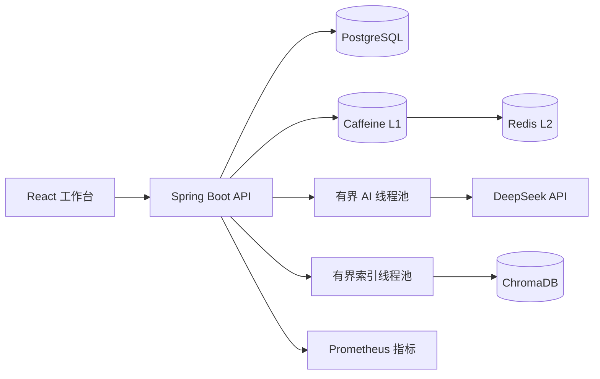
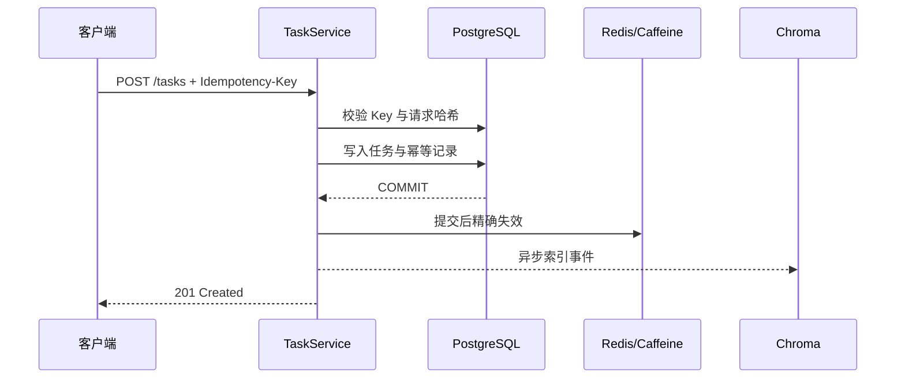

# 架构文档

[English](ARCHITECTURE.en.md) · [返回中文 README](../README.md)

## 1. 目标与边界
系统面向 10 万+任务和少量应用实例，在普通机器上优先保证可预测的延迟、故障隔离与运维简单性。PostgreSQL 是唯一事实源；Redis 和 ChromaDB 均为可选、可恢复的派生组件。当前不包含认证、多租户和数据库级高可用。

## 2. 组件视图

Spring Boot 后端保持无状态，除 Caffeine 短期本地缓存外不保存会话状态。生产环境可以部署少量后端副本，并把 PostgreSQL/Redis 交给具备备份和故障转移能力的托管服务。

## 3. 分层职责
- Controller：协议转换、参数验证、HTTP 状态。
- Service：事务边界、任务依赖、幂等、缓存和索引协调。
- Repository：JPA 查询与持久化。
- Domain/DTO：分别表达内部状态与外部 API 契约。
- Adapter：Redis、DeepSeek、Chroma 等外部系统访问。

## 4. 核心写入流程

事务提交前不触碰派生存储。数据库提交与异步索引之间仍存在短暂崩溃窗口，定时校准最近任务负责修复；因此 Chroma 只提供最终一致搜索。

## 5. 读取与缓存流程
按 ID 读取依次检查 Caffeine、Redis、PostgreSQL。Caffeine 的原子加载合并同 Key 并发未命中。Redis 不可用时立即回源，不进行长时间重试。写入提交后精确失效两级缓存。

多实例场景下，本地 L1 可能在短 TTL 内短暂陈旧。需要严格一致时关闭 L1；需要兼顾命中率时可增加 Redis Pub/Sub 失效广播。

## 6. 并发与背压
- 乐观锁拒绝基于旧 `version` 的覆盖写。
- AI 池队列满时拒绝请求，并映射为 HTTP 429。
- 索引池使用 CallerRunsPolicy，使生产者变慢而不是静默丢事件。
- HikariCP 连接数小于业务线程上限，避免数据库在应用过载时被连接风暴拖垮。
- 只有幂等读取重试瞬时数据库异常；写入重试由客户端配合幂等 Key 明确执行。

## 7. 可用性模型
- PostgreSQL：强依赖；不可用时 readiness 为 DOWN。
- Redis：弱依赖；不可用时为 DEGRADED，读取回源 PostgreSQL。
- Chroma：弱依赖；不可用时语义搜索降级为关键词搜索。
- DeepSeek：弱依赖；不可用时 AI 建议降级为本地规则。
- `/livez` 不探测外部服务，避免依赖抖动导致进程重启。

## 8. 10 万+任务的数据设计
- 常用状态、优先级、更新时间和 ID 组合索引支撑筛选。
- `(created_at, id)` 提供稳定键集分页，成本不随页码线性增长。
- offset 分页仅保留给浅页 UI。
- Caffeine 设 10000 条硬上限，Redis 设 256 MB 与 LRU 淘汰。
- 连接池、外部请求超时、线程池和队列均有明确上限。

## 9. 部署视图
当前 Docker Compose 是单机开发与演示拓扑，不构成真正高可用。生产建议：
1. 2–3 个无状态后端实例置于负载均衡后。
2. 使用带备份、监控与故障转移的 PostgreSQL。
3. Redis 可选；严格一致场景可直接关闭缓存。
4. Chroma 数据允许从 PostgreSQL 重建。
5. 依据 p95/p99、连接池等待和缓存命中率扩容。

## 10. 架构决策记录
### 不引入 RabbitMQ
当前后台任务仅为可重建向量索引，写入量较低。提交后事件、有界线程池、熔断和校准已满足需求。仅加入 RabbitMQ 无法解决“数据库提交与消息发布”的原子性。

当出现跨实例可靠消费、不可丢后台任务或持续高吞吐时，再引入 **Transactional Outbox + RabbitMQ + 幂等消费者**。

### 不引入 MongoDB 双写
任务关系、约束和事务更适合 PostgreSQL。把同一任务同时写入 MongoDB 会增加双写一致性与运维成本，却没有当前查询模式需要的收益。

### 暂不读写分离
10 万任务与少量实例下，复制延迟和路由复杂度高于收益。代码已标记只读事务，可在主库读负载成为实际瓶颈后接入路由数据源。
